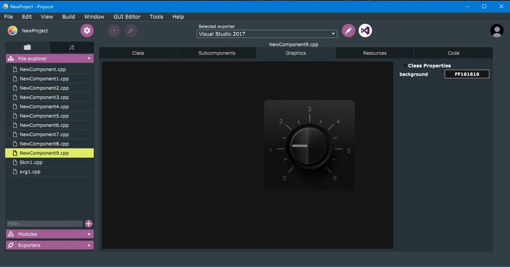

# Some JUCE workflow tips

1. [Usable plugin categories for JUCE Projucer](resources/plugin_categories.md) 
2. [Prototyping with JUCE Projucer GUI Editor](resources/prototyping.md)  
3. [Use JUCE Projucer GUI Editor to Convert text to a path](resources/TextToPath.md)  
4. [Fine tuning with JUCE_LIVE_CONSTANT](resources/JUCE_LIVE_CONSTANT.md) 

